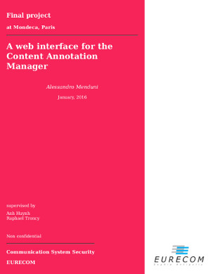

# Master thesis

This repository contains my Master thesis, worked on at [Mondeca](http://www.mondeca.com/) (Paris, FR) in the context of a Double Degree program between [TELECOM ParisTech](http://www.telecom-paristech.fr/) ([EURECOM](http://www.eurecom.fr/en)) and [Polytechnic of Turin](http://www.polito.it/).

Downloadable PDF [here](https://goo.gl/aBBFFK)

## Table of contents

- [Abstract](./src/content/ch0/ch0.md)
- [Chapter 1](./src/content/ch1/ch1.md), the context: Mondeca, the product and my responsibilities
- [Chapter 2](./src/content/ch2/ch2.md), the process: technologies, specs and sketches
- [Chapter 3](./src/content/ch3/ch3.md), the core screens
- [Chapter 4](./src/content/ch4/ch4.md), focusing on the user: from useful to usable
- [Chapter 5](./src/content/ch5/ch5.md), perfmatters: a deep dive into performance
- [Chapter 6](./src/content/ch6/ch6.md), the back-end: architecture, new features and the legacy problem
- [Chapter 7](./src/content/ch7/ch7.md), wrap up: i18n and future work
- [Conclusions](./src/content/ch8/ch8.md)
- [Bibliography](./src/content/head/bibliography.bib)

## Build instructions

Simply run `make`

Make sure you installed the dependencies `pandoc`, `texlive` and `prince`